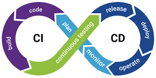
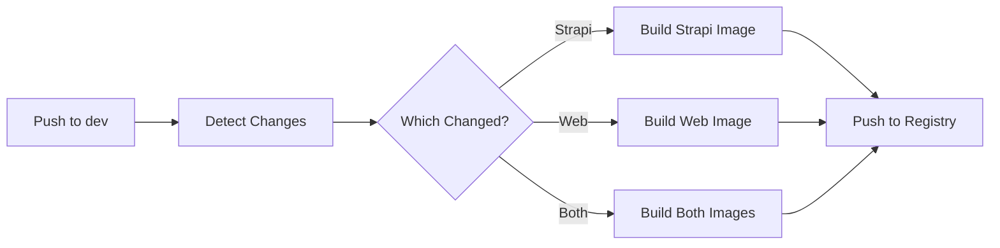

# CI/CD Pipeline Documentation

Complete guide to continuous integration and deployment workflows for the Educado monorepo.



> [!CAUTION]
> **Work in Progress**: All workflows are actively being improved. Contributions welcome!

---

## Table of Contents

1. [Overview](#overview)
2. [Common Concepts](#common-concepts)
3. [Secrets Configuration](#secrets-configuration)
4. [Workflows](#workflows)
   - [Build Dev](#build-dev-docker)
   - [Build Prod](#build-prod-docker)
   - [PR Checks](#pr-checks)
   - [Release Automation](#release-automation)
5. [Related Documentation](#related-documentation)

---

## Overview

The CI/CD pipeline automates:
- 🐳 **Docker image builds** - Strapi backend and Web frontend
- ✅ **Code quality checks** - Linting, formatting, type checking
- 🧪 **Testing***soon - Unit and integration tests
- 🚀 **Deployment** - Automated releases with semantic versioning

**Platform Support**: Works on both GitHub Actions and Gitea Actions.

---

## Common Concepts

### Change Detection

Workflows use smart change detection to only build/test what changed, significantly speeding up CI.

**How it works**:
A filter with rules is setup for each project. Only when files matching the rules change does the corresponding project get built/tested.

```yaml
filters: |
  strapi:
    - 'strapi/**'
    - 'openapi/**'
    - 'docker-compose.yml'
  web:
    - 'web/**'
    - 'openapi/**'
```

**Benefits**:
- ⚡ Skip unchanged services
- 🎯 Only build what's necessary
- 📦 Shared dependency tracking (`openapi/**` affects both services)

> [!TIP]
> This is especially useful in monorepos where multiple projects live together. See [Monorepo Overview](index.md) for more details.

---

## Secrets Configuration

### Required Secrets

All workflows need exactly **3 secrets**:

| Secret | Description | Example (GitHub) | Example (Gitea) |
|--------|-------------|------------------|-----------------|
| `REGISTRY_URL` | Container registry URL | `ghcr.io` | `gitea.example.com` |
| `REGISTRY_USERNAME` | Registry username | `github-username` | `gitea-username` |
| `REGISTRY_PASSWORD` | Access token | GitHub PAT with `write:packages` | Gitea token with registry access |

### Setup Instructions

#### GitHub Actions

1. Go to **Settings** → **Secrets and variables** → **Actions**
2. Click **New repository secret**
3. Add each secret with values from table above

#### Gitea Actions

1. Go to **Settings** → **Secrets**
2. Add each secret with values from table above

> [!IMPORTANT]
> Never commit secrets to git! Always use repository secrets/environment variables.

---

## Workflows

### Build Dev (Docker)

Builds and pushes development Docker images on every push to `dev` branch.

**File**: `.github/workflows/build-dev.yaml`

#### Trigger

```yaml
on:
  push:
    branches: [dev]
```

#### Process



**Steps**:

1. **Detect Changes** - Identifies which services changed
2. **Build Images** - Uses Turborepo's `turbo prune` for minimal context
3. **Tag & Push** - Creates multiple tags for flexibility

**Output Tags**:
```
registry.url/owner/repo/strapi:dev                # Latest dev
registry.url/owner/repo/strapi:dev-abc1234        # Specific commit
registry.url/owner/repo/web:dev
registry.url/owner/repo/web:dev-abc1234
```

**Optimization Features**:
- ✅ Docker layer caching (registry-based)
- ✅ Parallel builds when both services change
- ✅ Minimal build context via `turbo prune`

> [!NOTE]
> See [Docker & Turborepo](docker-turborepo.md) for detailed optimization explanations.

---

### Build Prod (Docker)

Builds production Docker images triggered by semantic version tags.

**File**: `.github/workflows/build-prod.yaml`

#### Trigger

Git tags matching these patterns:

| Tag Pattern | Builds | Example |
|-------------|--------|---------|
| `strapi-v*.*.*` | Strapi only | `strapi-v0.1.0` |
| `web-v*.*.*` | Web only | `web-v0.1.0` |
| `v*.*.*` | Both services | `v0.1.0` |

#### Process

1. **Parse Tag** - Determines which service(s) to build
2. **Build Images** - Same optimization as dev workflow
3. **Create Semantic Tags** - Multiple tags for flexible deployment

**Output Tags** (example for `strapi-v0.1.0`):
```
registry.url/owner/repo/strapi:0.1.0    # Full version (pin in production)
registry.url/owner/repo/strapi:0.1      # Minor version
registry.url/owner/repo/strapi:0        # Major version
registry.url/owner/repo/strapi:latest   # Latest release
```

**Best Practice**:
- 📌 Pin to **full version** (`0.1.0`) in production
- 🔄 Use **minor** (`0.1`) for auto-updates within minor versions
- ⚠️ Avoid **latest** in production (unpredictable)

> [!TIP]
> See [Release Process](release-process.md) for creating releases.

---

### PR Checks

Automated code quality checks on pull requests with intelligent change detection.

**File**: `.github/workflows/pr-checks.yaml`

#### Trigger

```yaml
on:
  pull_request:
    branches: [main, dev]
    paths-ignore:
      - "**.md"
      - "docs/**"
      - ".gitignore"
```

#### Overview

The workflow uses a **hybrid approach**:
- ✅ **Required checks** - Must pass to merge
- ⚠️ **Advisory checks** - Provide feedback without blocking

---

#### Change Detection

Determines which projects need checking:

```yaml
strapi:
  - 'strapi/**'
  - 'package.json'
  - 'turbo.json'
web:
  - 'web/**'
  - 'package.json'
  - 'turbo.json'
```

---

#### Strapi Checks (Required)

All checks are **required** and will block PR if they fail.

| Check | Job | What it does |
|-------|-----|--------------|
| 🎨 **Lint & Format** | `strapi-lint-format` | Verifies code style |
| 🔍 **Type Check** | `strapi-type-check` | Validates TypeScript types |
| 🧪 **Tests** | `strapi-test` | Runs test suite |
| 🏗️ **Build** | `strapi-build` | Verifies build succeeds |

**Trigger**: Changes to `strapi/**`, root `package.json`, or `turbo.json`

**Status**: ❌ Blocks merge if any check fails

---

#### Web Checks (Hybrid)

Web uses both required and advisory checks due to legacy code.

##### ✅ Required Checks (Block PR)

Only checks **changed files** - won't block for existing issues:

| Check | Job | What it does |
|-------|-----|--------------|
| 🎨 **Lint & Format** | `web-lint-format-changed` | Checks only modified files |
| 🔍 **Type Check** | `web-typecheck-changed` | Checks if TS/TSX files changed |

**How it works**:
```bash
# Git diff to find only your changes
git diff --name-only origin/$BASE...HEAD -- 'web/**/*.ts' 'web/**/*.tsx'
```

**Benefit**: You're only responsible for code you touch, not legacy issues! 🎉

##### ⚠️ Advisory Checks (Won't Block)

Runs on **entire codebase** with `continue-on-error: true`:

| Check | Job | What it does |
|-------|-----|--------------|
| 🎨 **Lint & Format** | `web-lint-format-full` | Full codebase check |
| 🔍 **Type Check** | `web-typecheck-full` | Complete type checking |
| 🧪 **Tests** | `web-test-full` | All tests |
| 🏗️ **Build** | `web-build-full` | Production build |

**Purpose**:
- 📊 Shows overall code health
- 📈 Tracks technical debt
- 🎯 Encourages gradual improvements

**Status**: May show ⚠️ yellow but won't block PR

##### 📊 Code Quality Statistics

Each advisory check now provides **detailed metrics** in the PR summary:

**Lint & Format**:
- ESLint errors count
- ESLint warnings count
- Files needing formatting

**Type Check**:
- TypeScript errors count

**Tests**:
- Tests passed ✅
- Tests failed ❌
- Total test count

**Build**:
- Build status (success/failed)
- Build time ⏱️
- Distribution size 📦

**How to view**:
1. Go to the PR **Checks** tab
2. Click on **"Required PR Checks Passed"** job
3. View the **Summary** section for full statistics

**Benefits**:
- 📈 Track code quality trends over time
- 🎯 See progress as you fix issues
- 💡 Identify areas needing attention

---

#### PR Status Summary

Final job (`pr-checks-complete`) determines pass/fail:

```yaml
✅ Required to pass:
  - Strapi: lint, type-check, test, build (if changed)
  - Web: changed-files checks only (if changed)

⚠️ Advisory (informational only):
  - Web: full codebase checks
```

**Result**: Green ✅ = all required checks passed, ready to merge!

---

#### Skip Patterns

Automatically skips for documentation-only changes:

```yaml
paths-ignore:
  - "**.md"        # Markdown files
  - "docs/**"      # Documentation folder
  - ".gitignore"   # Git ignore file
```

---

#### Example Scenarios

##### Scenario 1: Modify 2 Web Components

You change `web/src/components/Button.tsx` and `Header.tsx`:

1. ✅ **Required**: Lint/format/type-check those 2 files
2. ⚠️ **Advisory**: Full codebase checks (may fail on legacy code)
3. ✅ **Result**: PR passes if your 2 files are clean

##### Scenario 2: Modify Both Projects

You change files in `web/` and `strapi/`:

1. ✅ **Required**: All Strapi checks (must pass)
2. ✅ **Required**: Web changed-file checks (must pass)
3. ⚠️ **Advisory**: Web full checks (informational)
4. ✅ **Result**: PR passes if all required checks are green

##### Scenario 3: Documentation Only

You only update `README.md`:

- 🚫 **Skipped**: All checks automatically skipped
- ✅ **Result**: PR passes immediately

---

#### Migration Plan

> [!NOTE]
> **Temporary Hybrid Approach**
> 
> The Web advisory checks will become required as we clean up legacy code:
> 
> 1. ✅ Fix issues found by advisory checks
> 2. 📈 Track progress on technical debt
> 3. 🎯 Gradually promote checks from advisory → required
> 4. 🏁 Eventually all checks required (like Strapi)

---

#### Debugging Failed Checks

**View Logs**:
1. Go to PR → **Checks** tab
2. Click failed job name
3. Expand failed step for details

**Common Fixes**:
```bash
# Fix linting issues
npm run lint:fix

# Fix formatting issues  
npm run format:fix

# Run type check locally
npm run type-check

# Run tests locally
npm run test
```

**Local Testing**:
```bash
# Test before pushing
npm run lint:check && npm run format:check && npm run type-check && npm run test
```

> [!TIP]
> See the complete [Command Reference](turborepo.md#command-reference) for all quality check commands and what they do.

> [!IMPORTANT]
> Required checks **must pass** before merging. Fix issues locally and push again.

---

## Release Automation

Automatically creates GitHub/Gitea releases when version tags are pushed.

**File**: `.github/workflows/create-release.yaml`

#### Trigger

Git tags matching semantic versioning patterns:

| Tag Pattern | Creates Release For | Example |
|-------------|---------------------|---------|
| `strapi-v*.*.*` | Strapi Backend | `strapi-v0.1.0` |
| `web-v*.*.*` | Web Frontend | `web-v0.1.0` |
| `v*.*.*` | Full Stack (Both) | `v1.0.0` |

#### Process

1. **Parse Tag** - Determines project and version from tag name
2. **Generate Notes** - Auto-generates changelog from git commits since last tag
3. **Create Release** - Creates GitHub/Gitea release with:
   - Release title (e.g., "Web v0.1.0")
   - Tag reference
   - Docker image URLs
   - Commit changelog

**Example Release Notes**:
```markdown
## 🚀 Release 0.1.0
**Project:** Web
**Tag:** `web-v0.1.0`

### 📦 Docker Images
- `ghcr.io/owner/repo/web:0.1.0`
- `ghcr.io/owner/repo/web:latest`

### 📝 Changes
- feat: add new dashboard widget (abc1234)
- fix: resolve CORS issue (def5678)
```

**Automatic Behavior**:
- ✅ Triggered by `git push --tags`
- ✅ Runs in parallel with [Build Prod](#build-prod-docker) workflow
- ✅ Release created once Docker images are built

> [!TIP]
> See [Release Process](release-process.md) for complete release workflow including versioning, tagging strategy, and npm scripts.

---

## Next Steps

Now that you understand CI/CD:

- 🐳 **Docker optimization**: [Docker & Turborepo](docker-turborepo.md) - How images are built efficiently
- 🚀 **Creating releases**: [Release Process](release-process.md) - Version bumping and tagging
- 📦 **Web deployment**: [Web Deployment](../web/deployment.md) - Deployment modes

**Development workflow:**
- [Contributions Guide](contributions.md) - Git workflow and PR process
- [Command Reference](turborepo.md#command-reference) - Test commands locally before pushing

---

## Related Documentation

### Docker & Deployment
- [Docker & Turborepo Optimization](docker-turborepo.md) - Build optimization details
- [Web Deployment Modes](../web/deployment.md) - Dev vs production deployment

### Development Workflow
- [Turborepo Overview](turborepo.md) - Task orchestration and caching
- [Getting Started](getting-started.md) - Local development setup
- [Contributions](contributions.md) - Git workflow and PR process
- [Release Process](release-process.md) - Creating releases

### Technical Details
- [Monorepo Overview](index.md) - Architecture and structure
- [Environment Variables](environment-variables.md) - Configuration reference

